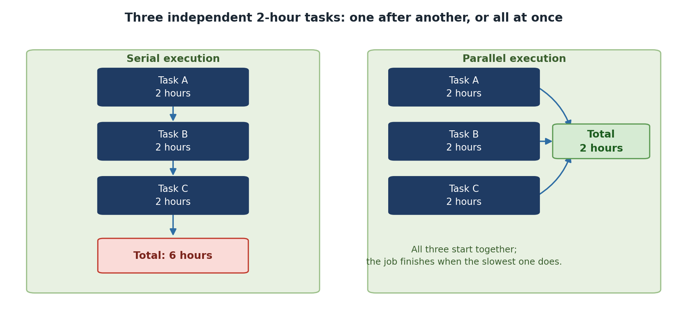

::::::::::::::::::::::::::::::::::::: questions
- When should I parallelize my code?
- What is speedup and how do I measure it?
- What is the difference between wall clock time and CPU time?
::::::::::::::::::::::::::::::::::::::::::::::::

::::::::::::::::::::::::::::::::::::: objectives
- Understand the difference between serial and parallel execution
- Learn about speedup and efficiency metrics
- Distinguish between wall clock time and CPU time
::::::::::::::::::::::::::::::::::::::::::::::::

## The Serial Computing Assumption

Processor speeds have plateaued around 3-4 GHz. The solution? **Parallelism**: doing multiple things at once.

### Serial vs. Parallel Execution

**Serial execution** (one task at a time):

```
Task A: [===========]
Task B:             [===========]
Task C:                         [===========]

Total time: 30 seconds
```

**Parallel execution** (on 3 processors):

```
Task A: [===]
Task B: [===]
Task C: [===]

Total time: 10 seconds
```

**Parallelism trades computational work across multiple processors to reduce wall clock time.**

{alt='Two panels. On the left, serial execution: Task A, Task B and Task C each take two hours and run one after another, giving a total of six hours. On the right, parallel execution: the same three tasks run at the same time and all feed into a total of two hours, with a note that the job finishes when the slowest task does.'}

## Understanding Speedup and Efficiency

### Speedup

$$S_p = \frac{T_1}{T_p}$$

Where $T_1$ = time on 1 processor and $T_p$ = time on *p* processors.

**Example:** Serial time 100s, parallel time on 4 cores 30s: $S_4 = 100/30 = 3.33$

### Efficiency

$$E_p = \frac{S_p}{p}$$

With $S_4 = 3.33$ and $p = 4$: $E_4 = 3.33/4 = 83\%$. The other 17% is overhead.

### Strong vs. Weak Scaling

**Strong scaling:** Same problem size, more processors. Ideal is linear speedup.

**Weak scaling:** Problem size grows with processors, execution time stays constant. Often more achievable.

## Wall Clock Time vs. CPU Time

**CPU time** = sum of compute time across all cores.
**Wall clock time** = actual elapsed time the user experiences.

```
1 core:  [============================] 100s wall time, 100 CPU seconds
4 cores: [========] 30s wall time, 120 CPU seconds (100s compute + 20s overhead)
```

If parallelism is working, wall clock time decreases even if total CPU time increases slightly.

## When Parallelism Helps (and When It Doesn't)

::::::::::::::::::::::::::::::::::::: callout

**Parallelism Helps When:**
- The problem is genuinely parallel (independent data points, loosely coupled)
- The parallelizable fraction is high (> 80% of execution time)
- Communication overhead is small relative to computation
- Wall clock time reduction matters to you

**Parallelism Does NOT Help When:**
- Code is inherently serial (long dependency chains)
- Communication overhead exceeds computation benefit
- Serial fraction is large (> 20%)
- Code already completes in seconds

::::::::::::::::::::::::::::::::::::::::::::::::

::::::::::::::::::::::::::::::::::::: challenge

**Analyzing a Workload**

You have a program: reading a file takes 50s (serial), processing takes 50s (parallelizable), writing output takes 10s (serial). Total: 110s. With 4 processors, how fast can it go?

::::::::::::::::::::::::::::::::::::: solution

Serial fraction = (50 + 10) / 110 = 55%. Only the 50s processing can be parallelized.

Best case: 50 + 50/4 + 10 = 72.5 seconds. Speedup: 110/72.5 = 1.52x.

Only 52% speedup -- the effort may not be worth it. Better to optimize I/O first.

::::::::::::::::::::::::::::::::::::::::::::::::
::::::::::::::::::::::::::::::::::::::::::::::::

::::::::::::::::::::::::::::::::::::: keypoints
- Parallel computing trades computational resources to reduce wall clock time
- Speedup and efficiency quantify parallel performance
- Profile and measure before parallelizing
- Not all problems benefit from parallelism
::::::::::::::::::::::::::::::::::::::::::::::::
