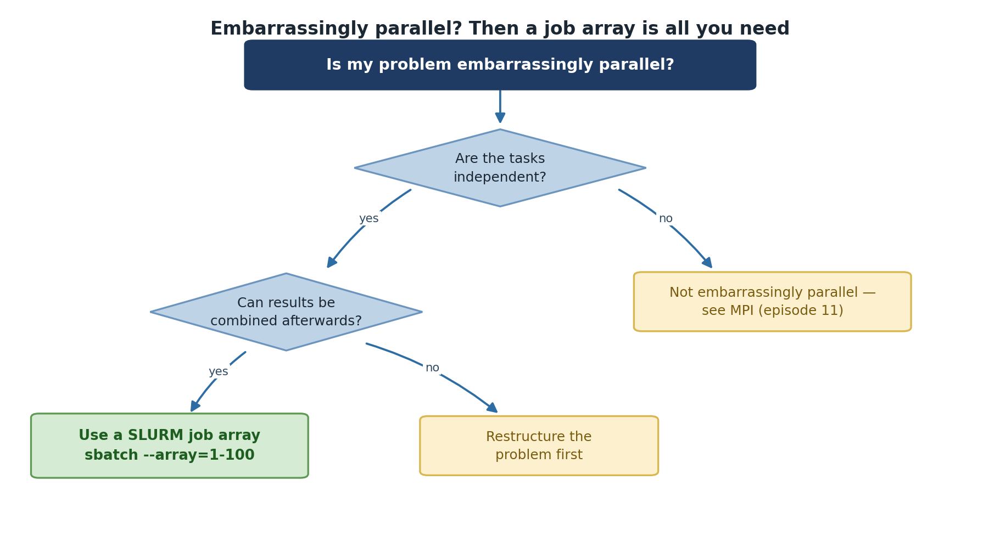

::::::::::::::::::::::::::::::::::::: questions
- How do I know if my problem is embarrassingly parallel?
- What are common embarrassingly parallel patterns?
- How do I convert serial code to run in parallel?
::::::::::::::::::::::::::::::::::::::::::::::::

::::::::::::::::::::::::::::::::::::: objectives
- Recognize embarrassingly parallel problems in your research
- Understand common patterns: parameter sweeps, Monte Carlo, batch processing
- Practice converting serial code to parallel structure
::::::::::::::::::::::::::::::::::::::::::::::::

## What Makes a Problem Embarrassingly Parallel?

A problem is embarrassingly parallel when:

1. **Tasks are completely independent**: No communication between tasks
2. **Results don't depend on task order**: Task A doesn't wait for Task B
3. **Each task needs only its input data**: No shared state
4. **Results can be combined trivially**: Simple aggregation at the end

::::::::::::::::::::::::::::::::::::: callout

**Checklist: Is Your Problem Embarrassingly Parallel?**

- Can each task run without data from other tasks? (YES = good)
- Does the order of execution matter? (NO = good)
- Can you run each task in isolation? (YES = good)
- Is combining results as simple as concatenating or averaging? (YES = very good)

If you answered YES to all four, use job arrays!

::::::::::::::::::::::::::::::::::::::::::::::::

{alt='A decision tree starting from the question, is my problem embarrassingly parallel. If the tasks are not independent, the answer is that it is not embarrassingly parallel and MPI is covered in episode 11. If they are independent, the next question is whether results can be combined afterwards; if yes, use a SLURM job array with sbatch --array=1-100, and if no, restructure the problem first.'}

## Common Patterns

### Pattern 1: Parameter Sweeps

```
Serial: 100 learning rates x 30 seconds each = 50 minutes
Parallel (100 cores): 30 seconds
```

### Pattern 2: Monte Carlo Simulations

```python
def estimate_pi(n_samples, seed):
    random.seed(seed)
    inside = sum(1 for _ in range(n_samples)
                 if random.random()**2 + random.random()**2 <= 1)
    return 4 * inside / n_samples
```

Each random trial is independent. Run 100 jobs, average the results.

### Pattern 3: Batch File Processing

Processing 10,000 images, DNA sequences, or medical scans independently.

### Pattern 4: Dataset Resampling

Bootstrap resampling: generate many independent subsets and compute statistics.

## Converting Serial Code to Parallel

### Step 1: Identify the Loop

```python
# Serial
for parameter in parameters:
    result = compute(data, parameter)
    save(result)
```

If `compute` doesn't depend on other iterations, it's a candidate.

### Step 2: Accept Parameter from Environment

```python
import os
job_id = int(os.environ['SLURM_ARRAY_TASK_ID'])
parameter = parameters[job_id - 1]
result = compute(data, parameter)
save(result)
```

### Step 3: Save Outputs Uniquely

```python
# Each job writes to unique filename
with open(f"result_{job_id}.txt", "w") as f:
    f.write(str(result))
```

### Step 4: Combine Results

```bash
cat result_*.txt > combined_results.txt
```

::::::::::::::::::::::::::::::::::::: challenge

**Is It Embarrassingly Parallel?**

**Code A:** Analyze 1000 gene sequences independently:
```python
for i in range(1000):
    gc_content = count_gc(read_sequence(f"seq_{i}.fasta"))
```

**Code B:** Simulate a time series where each step depends on the previous:
```python
state = initial_state
for t in range(1000):
    state = evolve(state)
```

::::::::::::::::::::::::::::::::::::: solution

**Code A:** YES. Each sequence is independent. Use job arrays for up to 1000x speedup.

**Code B:** NO. Each step depends on the previous one. Look for other parallelism (e.g., parallelize within `evolve()`, or run many independent simulations with different initial conditions).

::::::::::::::::::::::::::::::::::::::::::::::::
::::::::::::::::::::::::::::::::::::::::::::::::

::::::::::::::::::::::::::::::::::::: keypoints
- Embarrassingly parallel problems have no dependencies between tasks
- Common patterns: parameter sweeps, Monte Carlo, batch processing, resampling
- Convert serial code by accepting parameters and using unique output files
- These are the easiest to parallelize and often the most valuable
::::::::::::::::::::::::::::::::::::::::::::::::
