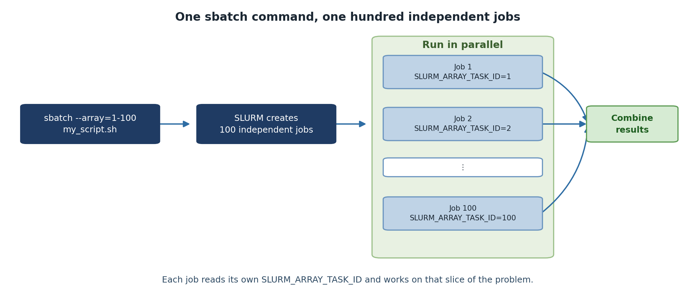

::::::::::::::::::::::::::::::::::::: questions
- How do I submit many jobs at once with SLURM?
- What is SLURM_ARRAY_TASK_ID and how do I use it?
- How do I map array indices to my parameters?
- How do I avoid hammering SLURM with thousands of tiny tasks?
::::::::::::::::::::::::::::::::::::::::::::::::

::::::::::::::::::::::::::::::::::::: objectives
- Understand SLURM job arrays and the --array flag
- Use SLURM environment variables to differentiate tasks
- Map array indices to parameters efficiently
- Monitor and manage job arrays as a unit
- Choose the right granularity for array tasks
::::::::::::::::::::::::::::::::::::::::::::::::

## Why Job Arrays

Job arrays are the cleanest way to express "run this script with N different inputs" to SLURM. They let you submit a thousand parallel jobs with one `sbatch` command, monitor them as a group, and cancel them as a group. Without arrays, you would write a wrapper script that loops over inputs and submits one job per iteration: harder to manage, more strain on the scheduler, and no easy way to gather results.

The pattern works for any embarrassingly parallel workload: parameter sweeps, batch processing of files, Monte Carlo simulations with different seeds, hyperparameter tuning. If your tasks are independent and you need to run many of them, arrays are almost always the right answer.

## Job Arrays vs. Loops

**Without job arrays (bad):**
```bash
sbatch sim.sh param_1.txt
sbatch sim.sh param_2.txt
# ... 100 times
```

**With job arrays (good):**
```bash
sbatch --array=1-100 sim.sh
```

The wrapper-loop version submits 100 separate jobs, each with its own job ID and accounting record. The array version submits one job ID with 100 tasks. SLURM handles array dispatch much more efficiently than 100 individual `sbatch` calls, and you can manage the entire batch as a single entity.

## Basic Syntax

```bash
#!/bin/bash
#SBATCH --job-name=simulation
#SBATCH --array=1-100
#SBATCH --time=01:00:00
#SBATCH --ntasks=1
#SBATCH --cpus-per-task=1
#SBATCH --mem=4G

echo "Running task $SLURM_ARRAY_TASK_ID"
python3 my_script.py --param_set $SLURM_ARRAY_TASK_ID
```

The `--array=1-100` directive tells SLURM to run this same script 100 times, each invocation seeing a different value of `$SLURM_ARRAY_TASK_ID` (1 through 100). Resource directives like `--time` and `--mem` apply per task, not per array. A 100-task array with `--mem=4G` total memory commitment is 400 GB, distributed across nodes as SLURM schedules.

### Array Index Variations

```bash
sbatch --array=1-100 script.sh        # IDs: 1, 2, ..., 100
sbatch --array=0-100:10 script.sh     # IDs: 0, 10, 20, ..., 100
sbatch --array=1,5,10,15,20 script.sh # Explicit list
sbatch --array=1-100%10 script.sh     # 100 tasks, max 10 running concurrently
```

The `%N` modifier is especially useful. Submitting `--array=1-1000%50` runs 1,000 tasks but only 50 at any time, which is gentler on shared resources and avoids consuming everyone else's queue priority.

::::::::::::::::::::::::::::::::::::: callout

**Array IDs are 1-Indexed by Default**

If indexing into a 0-indexed Python list, subtract 1:
```python
parameter = parameters[int(os.environ['SLURM_ARRAY_TASK_ID']) - 1]
```

Or just submit with `--array=0-99` instead of `--array=1-100`. Pick a convention and stick with it across your scripts.

::::::::::::::::::::::::::::::::::::::::::::::::

{alt='A flow diagram. The command sbatch --array=1-100 my_script.sh causes SLURM to create 100 independent jobs, which run in parallel. Job 1 has SLURM_ARRAY_TASK_ID equal to 1, Job 2 has 2, and Job 100 has 100. All of them feed into a step that combines the results. A caption notes that each job reads its own SLURM_ARRAY_TASK_ID and works on that slice of the problem.'}

## Practical Examples

### Parameter Sweep

```bash
#!/bin/bash
#SBATCH --job-name=ml_sweep
#SBATCH --array=1-100
#SBATCH --time=00:30:00
#SBATCH --mem=4G

LEARNING_RATE=$(sed "${SLURM_ARRAY_TASK_ID}q;d" param_list.txt)
python3 train_model.py \
    --learning_rate $LEARNING_RATE \
    --output results/model_${SLURM_ARRAY_TASK_ID}.pkl
```

The `sed "${N}q;d" file` idiom prints just line N from a file, which is the simplest way to map an array index to a parameter line in a text file.

### Batch File Processing

```bash
#!/bin/bash
#SBATCH --job-name=image_proc
#SBATCH --array=1-100
#SBATCH --cpus-per-task=4
#SBATCH --mem=8G

START=$(( (SLURM_ARRAY_TASK_ID - 1) * 10 ))
END=$(( SLURM_ARRAY_TASK_ID * 10 ))

for i in $(seq $START $((END - 1))); do
    python3 analyze_image.py images/image_${i}.tif --output results/analysis_${i}.csv
done
```

This processes 1,000 images in 100 array tasks of 10 images each. The "batch within a task" pattern (covered next episode) reduces SLURM scheduling overhead when individual tasks are very fast.

## SLURM Environment Variables

```bash
$SLURM_ARRAY_TASK_ID      # This task's index
$SLURM_ARRAY_JOB_ID       # Master job ID
$SLURM_ARRAY_TASK_MIN     # Minimum task ID
$SLURM_ARRAY_TASK_MAX     # Maximum task ID
$SLURM_JOB_ID             # Individual job ID for this task
```

`$SLURM_JOB_ID` is unique per task while `$SLURM_ARRAY_JOB_ID` is shared across all tasks in the array. Use `$SLURM_ARRAY_JOB_ID` if you want all output files to share a common prefix; use `$SLURM_JOB_ID` if you want each task's output to have a unique number.

## Monitoring and Managing

```bash
squeue -j 12345            # View all jobs in array
squeue -j 12345_5          # View specific task
scancel 12345              # Cancel entire array
scancel 12345_5            # Cancel only task 5
scancel 12345_{1-50}       # Cancel tasks 1-50
scontrol requeue 12345_5   # Requeue failed task
```

`scontrol requeue` is invaluable when one task in a 100-task array fails because of a transient error (a node hiccup, a temporary file system issue). You can re-submit only that one task without re-running the other 99.

### Dependency Chains

```bash
# Run analysis after all sweep jobs complete
sbatch --dependency=afterok:12345 analyze_results.sh
```

A common pattern: array job submits the sweep, dependency job waits for the entire array to finish, then aggregates the results. The aggregation script can iterate over all output files and produce a summary.

::::::::::::::::::::::::::::::::::::: callout

**Choosing array task granularity**

Each SLURM task has overhead: scheduling, container setup, environment activation, module loading. For very fast tasks (under a minute), this overhead can dominate the actual work.

If each task takes seconds: batch 50 to 100 of them into one task that loops internally.

If each task takes minutes to hours: one task per work unit is fine.

If each task takes days: consider checkpointing within the task so a hardware failure does not lose all progress.

A rule of thumb: aim for tasks of at least 5 minutes each. Below that, internal looping pays.

::::::::::::::::::::::::::::::::::::::::::::::::

::::::::::::::::::::::::::::::::::::: challenge

**Submit Your First Job Array**

Create a job array that runs a Monte Carlo pi estimation with 10 different seeds (array 1-10). Each task should save its result to `results/pi_N.txt`.

::::::::::::::::::::::::::::::::::::: solution

```bash
#!/bin/bash
#SBATCH --job-name=monte_carlo
#SBATCH --array=1-10
#SBATCH --time=00:05:00
#SBATCH --mem=2G

mkdir -p results
python3 monte_carlo.py $SLURM_ARRAY_TASK_ID
```

Submit: `sbatch run_monte_carlo.sh`

After completion:
```bash
python3 -c "
import glob, numpy as np
estimates = [float(open(f).read()) for f in sorted(glob.glob('results/pi_*.txt'))]
print(f'Mean: {np.mean(estimates):.6f}')
"
```

::::::::::::::::::::::::::::::::::::::::::::::::
::::::::::::::::::::::::::::::::::::::::::::::::

::::::::::::::::::::::::::::::::::::: challenge

**Right-Size an Array**

You have 5,000 input files to process; each takes about 30 seconds. Should you submit `--array=1-5000`, or batch them? Justify your choice.

::::::::::::::::::::::::::::::::::::: solution

Batch them. 5,000 tasks of 30 seconds each have an unfavorable ratio of SLURM overhead to actual work. A reasonable design: `--array=1-50%20`, where each task processes 100 files in a loop. That gives 50 tasks of about 50 minutes each, throttled to 20 concurrent. SLURM scheduling overhead becomes negligible, and you stay polite by not consuming 5,000 queue slots at once.

::::::::::::::::::::::::::::::::::::::::::::::::
::::::::::::::::::::::::::::::::::::::::::::::::

::::::::::::::::::::::::::::::::::::: keypoints
- SLURM job arrays submit many similar jobs with one command
- Each task gets a unique SLURM_ARRAY_TASK_ID
- Map array indices to parameters and data files
- Save results with unique filenames based on task ID
- Monitor and manage entire arrays with a single job ID
- Use `--array=1-1000%50` to throttle concurrency on shared clusters
- Aim for tasks of at least 5 minutes; batch internally if shorter
- `scontrol requeue` re-runs only failed tasks without redoing the rest
::::::::::::::::::::::::::::::::::::::::::::::::
